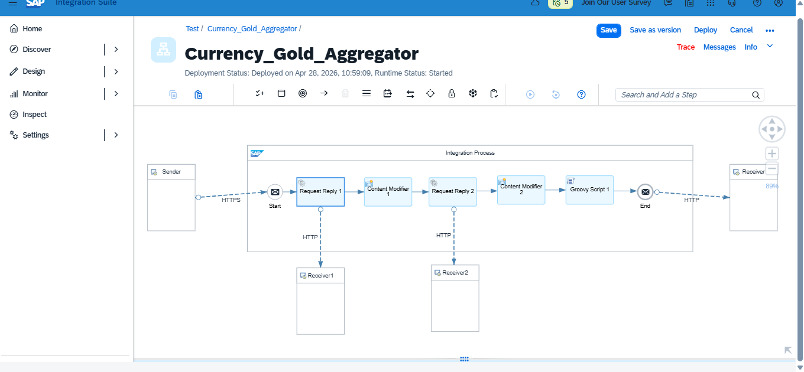
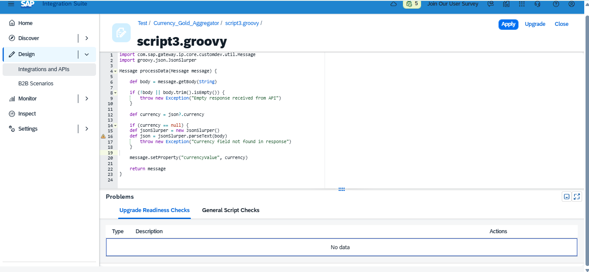
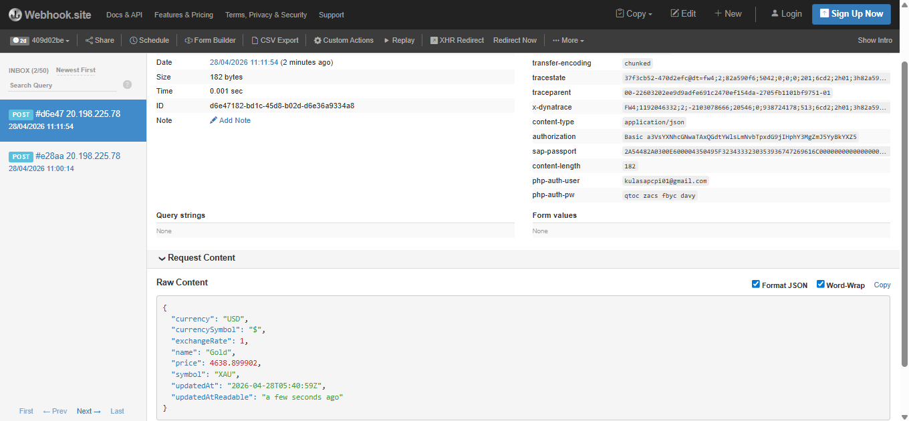
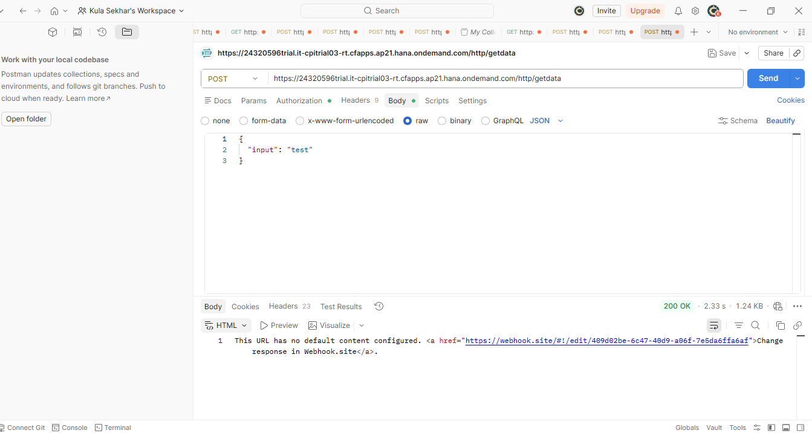

# SAP CPI API Integration Project

This project integrates Currency and Gold Price APIs using SAP Cloud Platform Integration (CPI).

## Features
- Request-Reply HTTP calls
- JSON parsing using Groovy Script
- Exchange Property handling
- Postman testing support

## Screenshots

## Tools Used
- SAP CPI
- Groovy Script
- REST APIs
- Postman
